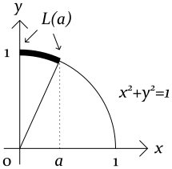
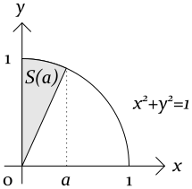
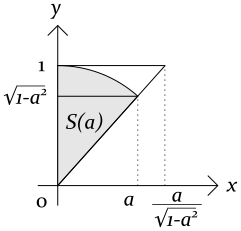

高校数学の範囲で、循環論法に陥らずに

* 円周の長さの公式 ... $2\pi r$
* 円の面積の公式 ... $\pi r^2$
* 三角関数の微分 ... $\sin'\theta = \cos\theta$
* 三角関数の極限 ... $\sin\theta / \theta \rightarrow 1$

などの公式を導く構成について説明する。

# 議論の流れ

単位円を $x^2+y^2=1$ と定義する。
範囲は $0 \leq x,y \leq 1$ だけを考える。

また以下2つの公式を用いる。
これらは汎用的な公式で、円の話題と無関係に成り立つ。

* 弧長の積分公式 $\int _0^a \sqrt{1+(y')^2} dx$
* 面積の積分公式 $\int _0^a y dx$

これらの公式から、単位円の弧長と面積の間の「便利な関係式」が導出される。
そして便利な関係式を用いて $2\pi r$ や $\pi r^2$ や $\sin\theta / \theta \rightarrow 1$ 等の諸公式を導出する。

# 扇形の弧長

単位円の扇形の弧長を、下図のように $L(a)$ と定める。

弧長 $L(a)$ は次の積分で求まる。

$$\begin{align}
L(a) = \int _0^a \sqrt{1+(y')^2} dx
\end{align}$$

ここに $y=\sqrt{1-x^2}$ を微分した $y'=-x/\sqrt{1-x^2}$ を代入することで、次の式を得る。

$$\begin{align}
L(a) = \int _0^a \frac{dx}{\sqrt{1-x^2}}
\end{align}$$

# 三角関数の定義と微分 (以降のストーリーと無関係な話)

関数 $L(a)$ を $a$ で微分して逆数を取ると、次の式が得られる。

$$\begin{align}
\frac{da}{dL} = \sqrt{1-a^2}
\end{align}$$

また $L(a)=\theta$ を $a$ について解いた式を $a = \sin\theta$ と書く。
これらを上式に代入することで、次の式を得る。

$$\begin{align}
\frac{d}{d\theta} \sin\theta = \sqrt{1-\sin^2\theta}
\end{align}$$

右辺を $\cos\theta$ と書いたものが、いわゆる三角関数の微分公式。
これを導出する上で $\sin\theta / \theta \rightarrow 1$ の極限公式は不要である。

# 扇形の面積

単位円の扇形の面積を、下図のように $S(a)$ と定める。

扇形の面積 $S(a)$ は、 $y$ の積分値から底辺を $a$ とする三角形の面積を引けば求まる。

$$\begin{align}
S(a) = \int _0^a \sqrt{1-x^2}dx - \frac{1}{2}a\sqrt{1-a^2}
\end{align}$$

# 便利な関係式

扇形の弧長と面積について、実は以下の関係式が成り立つ。

$$\begin{align}
2 S(a) = L(a)
\end{align}$$

この関係式を示す。まず左辺から右辺を引く。

$$\begin{align}
2 S(a) - L(a) = \int _0^a \left( 2\sqrt{1-x^2} - \frac{1}{\sqrt{1-x^2}} \right) dx - a \sqrt{1-a^2}
\end{align}$$

両辺を微分する。

$$\begin{align}
\frac{d}{da} \left[ 2 S(a) - L(a) \right]
&= 2\sqrt{1-a^2} - \frac{1}{\sqrt{1-a^2}} - \left( \sqrt{1-a^2} - \frac{a^2}{\sqrt{1-a^2}} \right)
\\
&= \sqrt{1-a^2} - \frac{1-a^2}{\sqrt{1-a^2}}
\\
&= 0
\end{align}$$

よって $2S(a)'=L(a)'$ が成立。
また $a=0$ のとき $2S(0)=L(0)$ が成り立つので、一般の $a$ についても $2S(a)=L(a)$ が成立。

# 円周率

円周率を $\pi$ を次の式で定義する。

$$\begin{align}
\pi = 4 \int _0^1 \sqrt{1-x^2}dx
\end{align}$$

これを用いると、単位円の面積は $\pi$ と書ける。
また便利な関係式 $2S(1)=L(1)$ より、円周の長さは $2\pi$ と求まる。
これらの積分を $rx=X$ と $ry=Y$ で置換することで、半径 $r$ の円の面積公式 $\pi r^2$ と円周公式 $2\pi r$ を得る。

# 三角関数のゼロ極限

扇形を大小2つの直角三角形ではさんだ図を考える。

扇形と三角形の面積を比較すると、以下の不等式が得られる。

$$\begin{align}
\frac{1}{2}a\sqrt{1-a^2}
\lt
S(a)
\lt
\frac{a}{2\sqrt{1-a^2}}
\end{align}$$

便利な関係式 $2S(a)=L(a)$ を代入して逆数を取ると、次の不等式が得られる。

$$\begin{align}
\sqrt{1-a^2}
\lt
\frac{a}{L(a)}
\lt
\frac{1}{\sqrt{1-a^2}}
\end{align}$$

$a \rightarrow 0$ の極限を取る。このとき $L(a)=\theta$ も同時に $0$ に漸近する。

$$\begin{align}
\lim _{a \rightarrow 0} \frac{a}{L(a)} = 1
\end{align}$$

三角関数に書き直すことで、以下の収束公式を得る。

$$\begin{align}
\lim _{\theta \rightarrow 0} \frac{\sin\theta}{\theta} = 1
\end{align}$$
